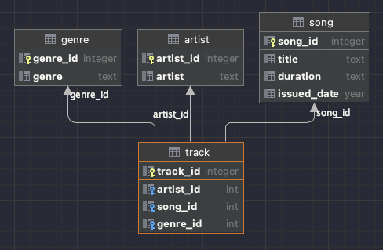

## Table of contents
* [General info](#general-info)
* [Database Design](#Database Design)
* [Code snippets](#Code snippets)

## General info
This project is embeded sqlite database.
When start demo project it will create tables and insert dummy data
Futhermore, GetMusicTracks method in MusicLibrary class is tested
When it download or clone than pleas move to MusicLibraryDemo/MusicLibrary folder
in terminal and enter dotnet run
```
/Download/PlacementAssignment/MusicLibraryDemo/MusicLibrary
: dotnet run
```
## Database Design


## Code snippets
SQL
```
select a.artist, s.title, s.duration, s.issued_date, g.genre from track
left join artist a on track.artist_id = a.artist_id
left join song s on track.song_id = s.song_id
left join genre g on track.genre_id = g.genre_id
where issued_date > 2021
order by artist, title"
```
C# MusicLibrary
```
public IEnumerable<Track> GetMusicTracks(string genre="")
{
    var result = new List<Track>();
    using (var connection = new SqliteConnection(new DB("./musiclibrary.db").getConnectionString()))
    {
        connection.Open(); 
        var cmd = connection.CreateCommand();
        cmd.CommandText = @"select a.artist, s.title, s.duration, s.issued_date, g.genre from track
                            left join artist a on track.artist_id = a.artist_id
                            left join song s on track.song_id = s.song_id
                            left join genre g on track.genre_id = g.genre_id
                            where issued_date > 2021
                            order by artist, title";

        using (var reader = cmd.ExecuteReader())
        {
            while (reader.Read())
            {
                var track = new Track
                {
                    Artist = reader.GetString(0),
                    Title = reader.GetString(1),
                    Duration = reader.GetString(2),
                    IssuedDate = reader.GetString(3),
                    Genre = reader.GetString(4)
                };
                result.Add(track);
            }
        }
    }

    if (genre != null && genre.Length > 0)
    {
        return result.Where(g => g.Genre == genre).Where(t => t.Duration != "0:00").ToList();
    }
        
    return result.Where(t => t.Duration != "0:00").ToList();
}
    
```
C# MusicLibrary Tests
```
public void GetMusicTracksReturnsAtleastOnetrackOrMore()
{
    var db = new DB("./musiclibrary.db");
    db.CreateTable();
    db.InsertValue();

    var musicLibrary = new MusicLibrary.Models.MusicLibrary();
    var tracks = musicLibrary.GetMusicTracks();
    Assert.True(tracks.Count() > 0);
}
```
```
public void GetMusicTracksReturnsAtleastOnetrackOrMore()
{
    var db = new DB("./musiclibrary.db");
    db.CreateTable();
    db.InsertValue();

    var musicLibrary = new MusicLibrary.Models.MusicLibrary();
    var tracks = musicLibrary.GetMusicTracks();
    Assert.True(tracks.Count() > 0);
}
```
```
public void GetMusicTracksReturnsTracksWithMatchingGenre()
{
    var db = new DB("./musiclibrary.db");
    db.CreateTable();
    db.InsertValue();

    var musicLibrary = new MusicLibrary.Models.MusicLibrary();
    var tracks = musicLibrary.GetMusicTracks("Pop");
    Assert.True(tracks.Count() == 3);
}
```
```
public void GetMusicTracksReturnsNoTracksWithZeroDuration()
{
    var db = new DB("./musiclibrary.db");
    db.CreateTable();
    db.InsertValue();

    var musicLibrary = new MusicLibrary.Models.MusicLibrary();
    var tracks = musicLibrary.GetMusicTracks();
    var isIncludeZeroDuration = tracks.Any(r => r.Duration == "0:00");
    Assert.True(isIncludeZeroDuration == false);
}
```

